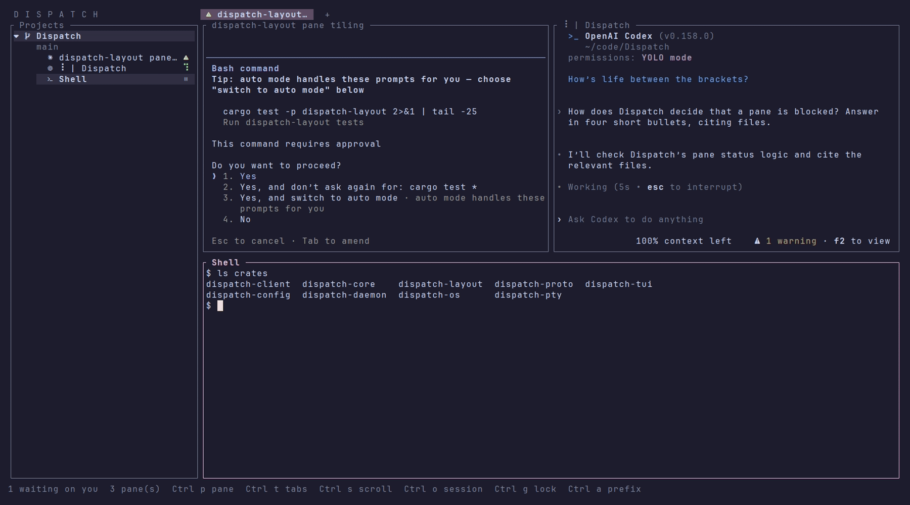
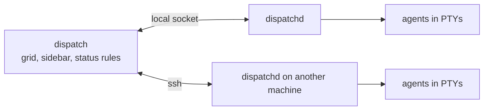

<div align="center">

# Dispatch

**Run several coding agents side by side, and see which one needs you.**

[](https://github.com/kudayyurter/Dispatch/actions/workflows/ci.yml) [](LICENSE)

[Install](#install) · [Usage](#usage) · [Docs](docs/usage.md)



</div>

Dispatch is a terminal interface for Claude Code, Codex, agy, opencode, or your own shell, across all your projects. It reads each pane's terminal as it runs, so one sidebar tells you which agent is working, done, or waiting on a permission prompt.

- **Tiled live terminals:** up to four panes per tab, as many tabs as you like, with zellij-style keys.
- **State at a glance:** each pane is marked working, idle, done, or blocked, and the status row counts the ones waiting on you.
- **Agents that outlive the window:** with `--attach`, a daemon owns the agents, so you can close the interface and come back, or watch from several windows.
- **Per-agent settings:** pick the model, effort and permission mode before a pane opens.
- **Delegation and other machines:** an agent can hand a task to a second agent once you approve it, and agents on other machines show up over ssh.

> [!NOTE]
> Early (0.1.0): no packaged releases yet, so you build from source. Runs on Linux, macOS and Windows; CI tests all three.

## Install

You need Rust 1.89+, [Zig 0.16.0](https://ziglang.org/download/) (it builds the vendored `libghostty-vt` terminal engine; set `ZIG` if the `zig` on your `PATH` is another version), a [Nerd Font](https://www.nerdfonts.com/) in your terminal, and at least one of `claude`, `codex`, `agy` or `opencode` on your `PATH` (your shell works without any). Offline, Windows and contributor builds are in [docs/building.md](docs/building.md).

```sh
git clone https://github.com/kudayyurter/Dispatch.git && cd Dispatch
cargo build --release    # the first build fetches Zig packages, so it needs network
```

## Usage

Open the directory you are in as a project:

```sh
./target/release/dispatch --attach .
```

`--attach` starts the daemon, `dispatchd`, if none is running, and the agents belong to it from then on. Without `--attach`, the agents are children of the window and quitting ends them.

| Key | Does |
|---|---|
| `Alt n` | new pane: pick your shell or an agent (`e` first for its model, effort, permissions) |
| `Alt` + arrows | move between panes |
| `Ctrl p x` | close the focused pane and end its agent |
| `Ctrl t` | tab mode; the status row lists its keys |
| `Ctrl s` | scroll mode |
| `Ctrl o q` | quit; attached, the agents keep running for next time |

| Command | Does |
|---|---|
| `dispatch delegate "…"` | an agent hands a task to a second one ([more](docs/delegation.md)) |
| `dispatch machine add me@tower` | add a machine's agents over ssh ([more](docs/daemon.md)) |

Every other key goes to the focused pane. All modes, tabs, the sidebar's glyphs and key rebinding are in [docs/usage.md](docs/usage.md).

> [!WARNING]
> Every agent Dispatch ships **starts without its permission prompts** (Codex also without its sandbox), so it can work without stopping to ask. Turn them back on per agent in the new-pane picker: `e`, change Claude's **Permissions** or turn **Skip prompts** (Codex, agy) or **Auto-approve** (opencode) off, then `s` to save. Anything that can reach the daemon's socket can do what a client can; read [docs/security-model.md](docs/security-model.md) before running agents you don't trust.

## Configuration

Settings live in `~/.config/dispatch` on Linux, `~/Library/Application Support/dispatch` on macOS, and `%APPDATA%\dispatch\config` on Windows; `DISPATCH_CONFIG_DIR` points elsewhere. Every option, with examples, is in [docs/configuration.md](docs/configuration.md).

| File | Holds |
|---|---|
| `config.toml` | keys, shell, motion, delegation caps |
| `harnesses/*.toml` | one file per agent: how to launch it, its settings, its status rules; add a file to add an agent |
| `harness-settings.toml` | the defaults you saved from the picker |
| `projects.toml`, `machines.toml` | the projects and machines in the sidebar |

## How it works



Each pane is a real terminal, emulated with Ghostty's vendored `libghostty-vt`. The client reads every pane's screen and title with per-agent rules (adapted from [herdr](https://github.com/ogulcancelik/herdr)) to spot spinners and permission prompts. Crate-by-crate layout: [docs/building.md](docs/building.md).

## License

Apache-2.0. See [LICENSE](LICENSE) and [NOTICE](NOTICE) for vendored and derived code.
